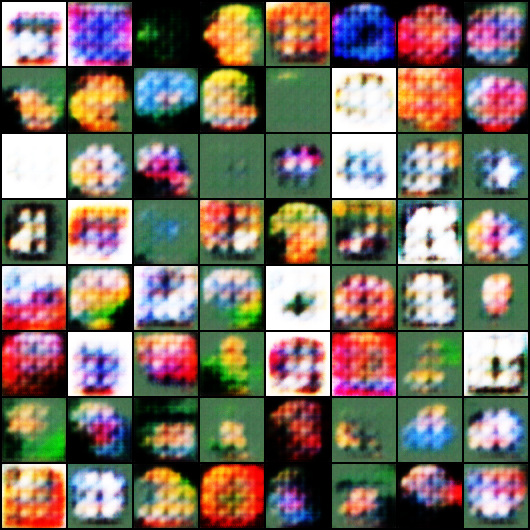
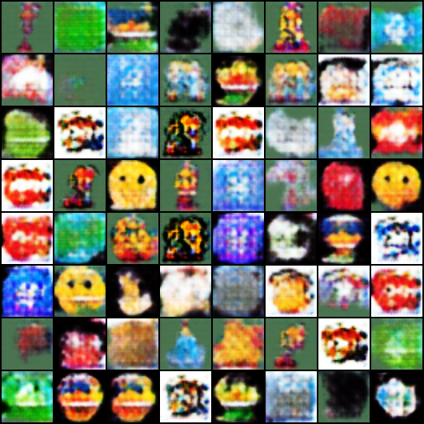

# 🧠 GAN Emoji Generator

This project implements and improves a Deep Convolutional Generative Adversarial Network (DCGAN) to generate 64x64 RGB images. It shows the journey from basic GAN outputs to meaningful improvements in image fidelity and training stability.

---

## 📸 Output Comparison

| Epoch 20 (Baseline) | Epoch 50 (Improved) | Epoch 100 (Enhanced) |
|---------------------|---------------------|----------------------|
|  |  |  |

---

## 🔧 Architecture Overview

### Generator
- 5-layer ConvTranspose2D upsampling network
- Uses `BatchNorm` + `ReLU` + `Tanh`
- Input: 64-dim latent noise vector → Output: 3x64x64 RGB image

### Discriminator
- 5-layer Conv2D downsampling network
- Uses `LeakyReLU`, `Dropout`, and `BatchNorm`
- Output: probability real/fake

---

## 🔍 Key Improvements (vs baseline)

| Enhancement | Impact |
|-------------|--------|
| ✅ Label smoothing (real labels as 0.9) | Prevents D from becoming overconfident |
| ✅ Dropout in Discriminator | Adds regularization, avoids memorization |
| ✅ Training stability (100 epochs) | Smoother G/D convergence |
| ✅ Saved intermediate outputs | Tracks model progress visually |

---


---

## 🧠 Learnings

- Training GANs is **unstable**, but small changes (like label smoothing) can help a lot.
- Loss values alone are **not reliable**—visual progress is key.
- Generator must “outsmart” a constantly improving Discriminator.

---

## 🛠️ Future Ideas

- 🎯 Add attention in Generator
- 🧪 Track with `wandb` or `TensorBoard`
- 🎨 Extend to face generation, style transfer

---

## 🏁 How to Run

```bash
# Train GAN
python train.py
```
```
# Save outputs at key epochs
outputs/epoch_020.png
outputs/epoch_050.png
outputs/epoch_100.png
```
